# 牛派普通用户使用指南

牛派是一款本地运行的 A 股行情研究工具。它适合用来**看行情、管理自选、研究指标、条件选股和回测策略**，也可以查看快讯、全球指数、基金、期货期权、港美股（长桥，只读行情），并把监控结果推送到企业微信或飞书。

> 本指南面向第一次使用牛派的用户。截图用于说明页面布局，实际行情和数据会随时间变化。

## 一、第一次使用

### 1. 下载并启动

在仓库的 [Releases](../../releases) 页面下载：

- `bull-pie_<版本>_x64-setup.exe`：安装版，适合日常使用；
- `bull-pie-<版本>-portable.zip`：免安装版，解压后直接运行。

软件需要 Windows 10 1803+ / Windows 11（64 位）以及 WebView2 运行时。若启动后闪退或白屏，请先安装微软 WebView2 Runtime。

### 2. 配置数据接口

首次启动后进入 **设置 → API 凭据**，粘贴你自己申请的数据接口 Key，点击「保存并自检」。Key 只保存在本机，不要把它发到 Issue、群聊或截图里。

### 3. 同步代码表和行情

进入 **设置 → 数据**：

1. 点击「同步全市场代码表」，让搜索可以识别股票中文名；
2. 如果要做全市场选股或回测，再点击「导入全市场日线」；
3. 日常使用时，收盘后可执行增量同步，不需要反复导入全部数据。

## 二、从搜索一只股票开始

在首页搜索框输入股票名称、代码或简称，例如「茅台」或 `600519`，按回车即可进入个股页面。

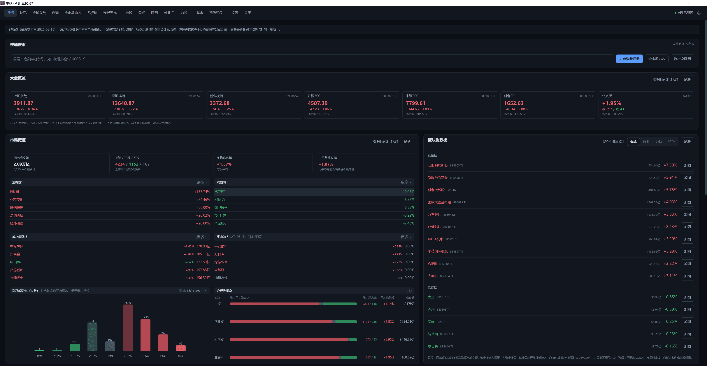

首页用于快速了解大盘、市场宽度、板块和热门方向。「板块涨跌榜」里每一行右侧有个小角标，点一下就地展开该板块**涨幅前五**的成分股（再点收起、默认收起），点股票名进个股页、点「成分股明细」进板块页；因为要现拉这一行的成分股行情，展开后可能需要等一两秒。集合竞价卡片在 09:15–09:30 会自动展开，其余时间默认收起。集合竞价接口只覆盖 A 股个股。

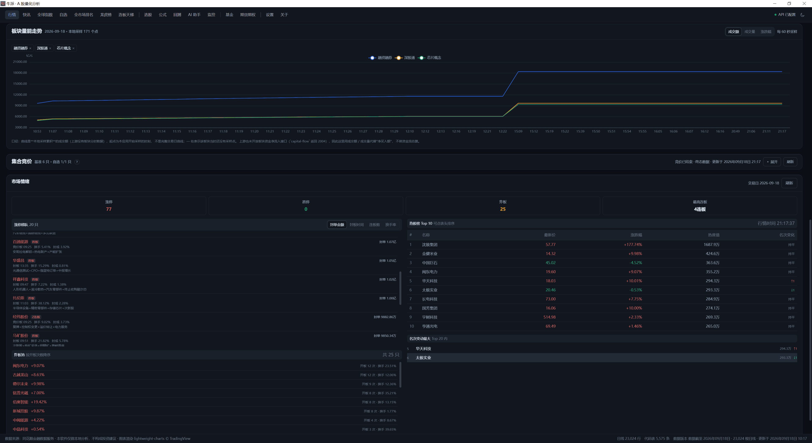

个股页可以查看日线、周线、月线 K 线，切换前复权、后复权和不复权，并叠加均线、MACD、RSI、成交量等指标。

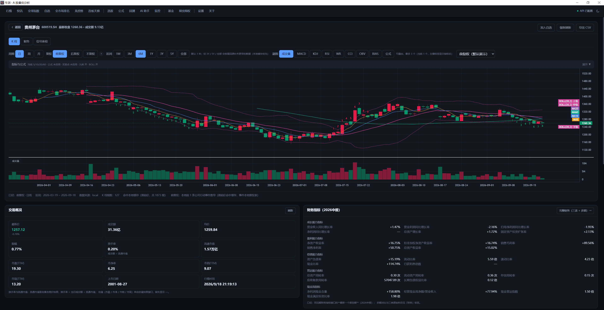

向下滚动还可以查看财务、分红、人气、异动、资金流、股东户数和公告等信息。不同数据块会标注各自的数据来源。

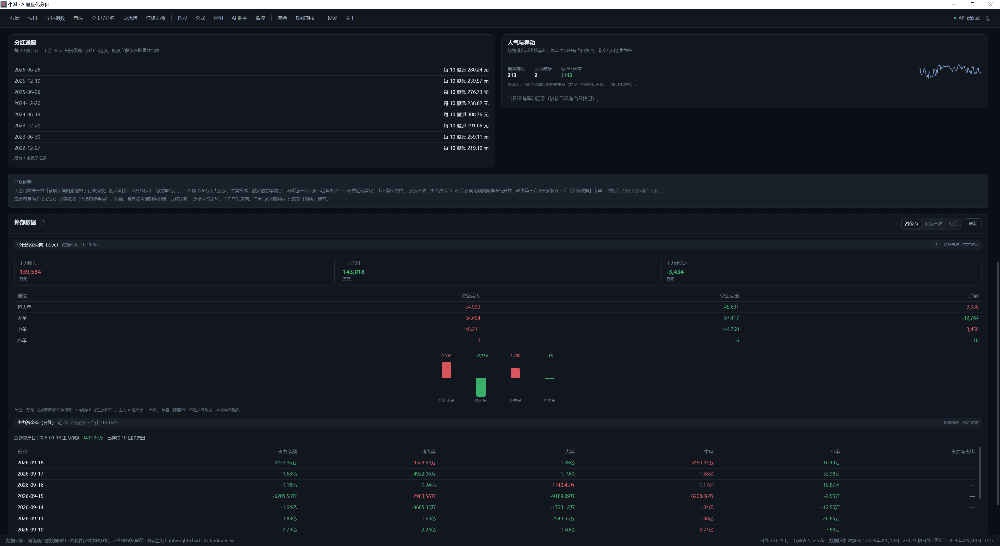

## 三、常用功能

### 自选股

在个股页或列表中把股票加入自选。自选页支持分组、拖拽排序、批量查看行情和手动/自动刷新；右键股票可以加入分组或移出自选。

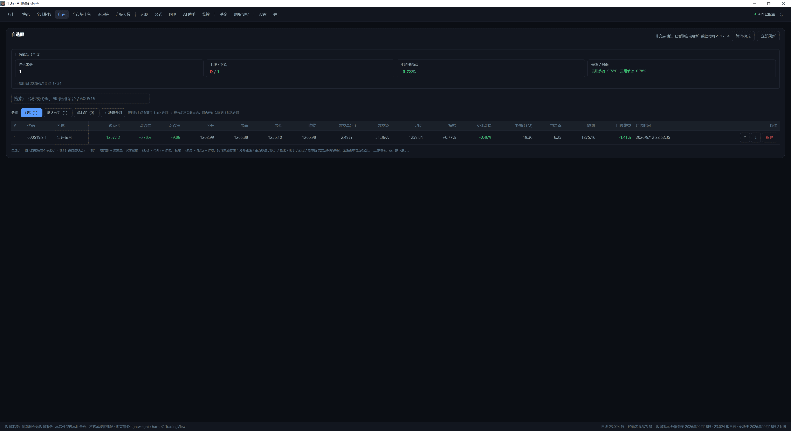

### 持仓账本

「持仓」页面采用手工流水核算，适合记录自己的买入、卖出、分红、入金和出金。建议按下面的顺序录入：

1. 第一次补录已有持仓时，先记一笔入金，再记买入；
2. 买卖记录填写日期、股票、数量、成交价和手续费；
3. 分红、出金和其他费用单独记账；
4. 在交易笔记里补充买卖理由、执行计划或复盘结论。

页面顶部的「当日概览」展示最新交易日的当日盈亏、当日收益率，以及相对同期上证指数的涨跌幅。下面的入口卡片可以分别打开：

行情口径：**开盘日按实时最新涨跌幅计算**（当日盈亏、最新价、持仓市值都用实时价，盘中按刷新档位自动更新）；**非开盘日（周末、节假日）按最近一个收盘时间的涨跌幅计算**。页面标题上会写明当前用的是「实时价」还是「最近收盘价」；实时行情取不到时会先按最近收盘价算，并在提示里说明。「相比上证」是与持仓同一时点的单日超额涨跌幅（盘中就是指数实时涨跌幅），不是从建仓开始的累计收益。

- **资产分析**：查看本月、近三月、今年或全部区间的盈亏、收益率、收益曲线、区间内股票盈亏热力图、当前持仓、盈利/亏损天数、胜率和仓位情况；
- **清仓分析**：查看已经卖完的股票、累计投入、交易盈亏、分红和收益率；
- **收益日历**：按日、月、年查看收益，并查看组合与同期上证指数的收益率对比；
- **交易笔记**：集中查看已有笔记，点击后可以回到原流水继续编辑。

目前持仓模块只使用快照和日线数据，不提供完整的日内分时盈亏曲线。

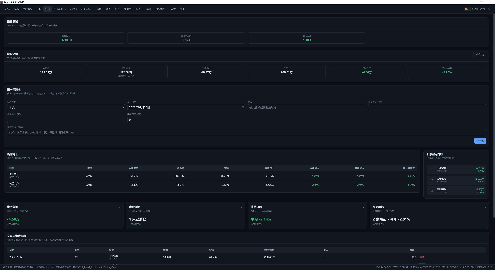

> 如果只记买入、不记入金，现金会变成负数，进而导致总资产显示为负。可以点击页面提示中的「按缺口补录入金」，确认日期后保存。

### 快讯和全球指数

「快讯」页面集中展示 7×24 财经快讯，最新内容在最上方；「全球指数」页面可以查看主要国际指数、世界地图、涨跌排序和分市场小结。

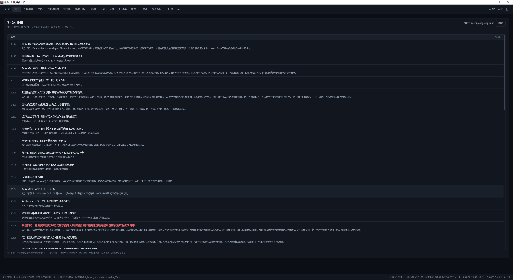

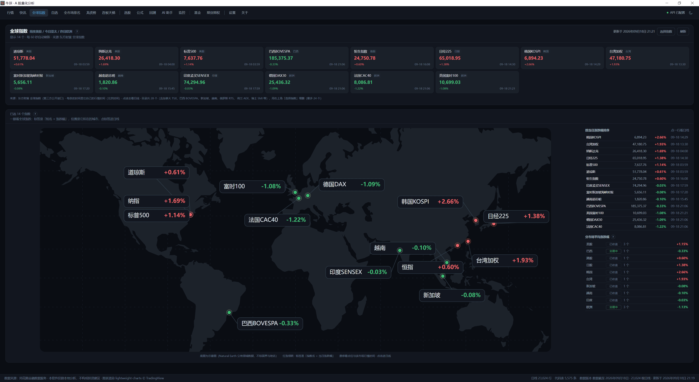

快讯和全球指数属于公开信息展示功能，网络或上游接口异常时可能暂时没有数据，不影响本地行情、选股和回测。

### 市场排名、龙虎榜和连板

想快速找强势方向，可以使用全市场排名、龙虎榜和连板天梯：

- **全市场排名**：按涨跌幅、成交额等维度浏览股票；
- **龙虎榜**：查看上榜股票及机构、游资和席位信息；
- **连板天梯**：按连续涨停高度查看市场梯队。

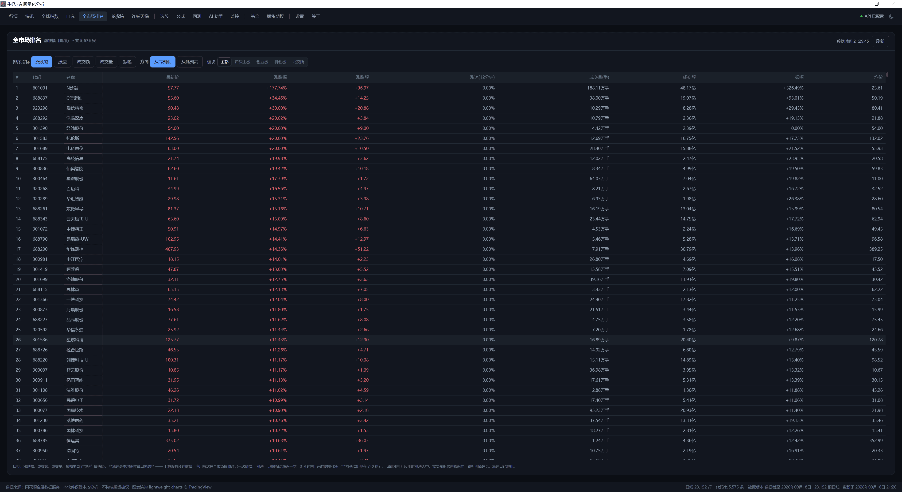

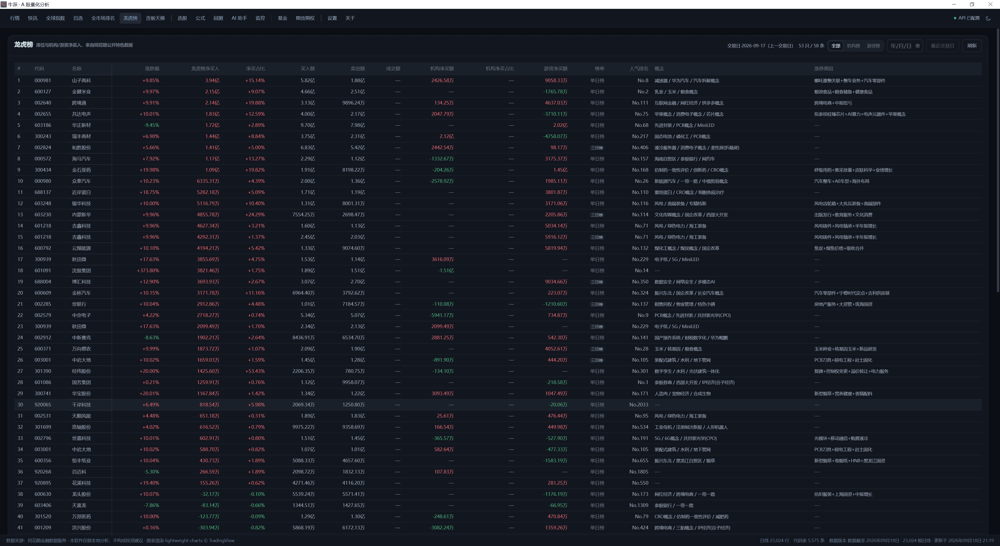

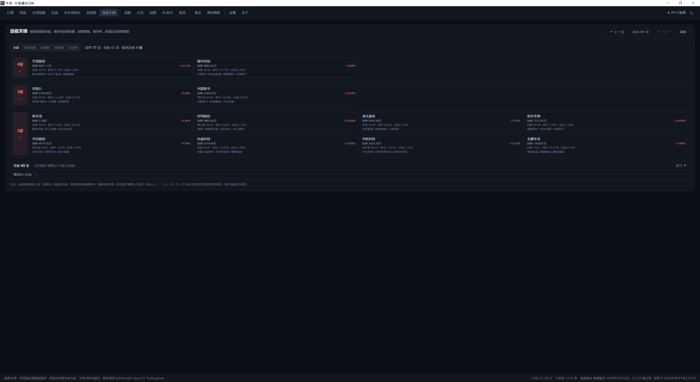

### 条件选股

在「条件选股」中选择已有公式，或使用自己保存的公式扫描自选、本地缓存或全市场日线。命中后可以加入自选，再跳转到个股页查看 K 线和买卖点。

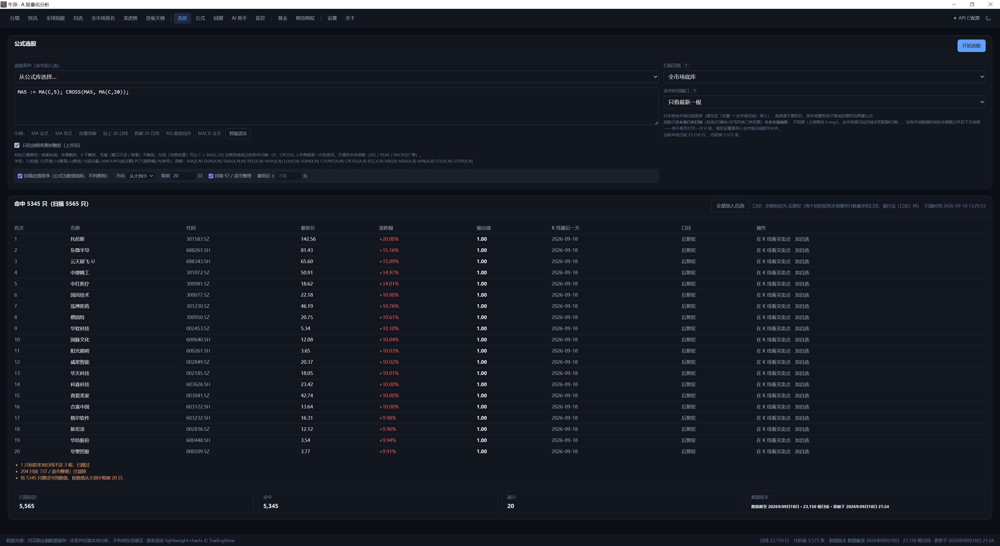

### 回测

进入「回测」后，选择股票池、时间区间、策略参数和资金费率，点击运行即可查看：

- 净值曲线和基准对比；
- 收益、回撤、胜率等绩效指标；
- 每一笔交易的明细；
- 可导出的 CSV 结果。

回测是对历史数据的模拟，不代表未来收益。默认口径包含 T+1、次日开盘成交等规则，和其他软件比较时要先确认设置一致。

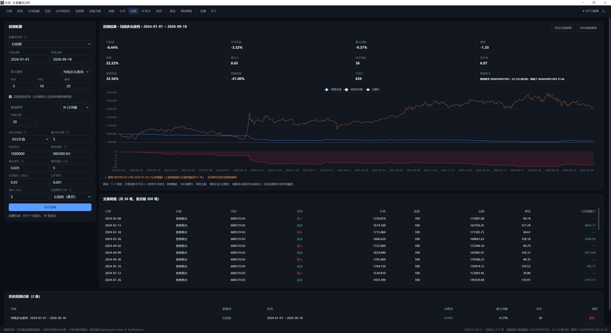

### AI 助手（可选）

AI 助手需要你自行配置本机 Ollama 或兼容的外部模型接口。它可以帮助解释指标、整理公式、复盘回测或用自然语言查询数据。

使用前请先确认「将发送的内容」，并根据页面提示决定是否允许发送到外部模型。股票名单和数值由本地数据与计算引擎提供，模型只负责理解问题和组织回答。

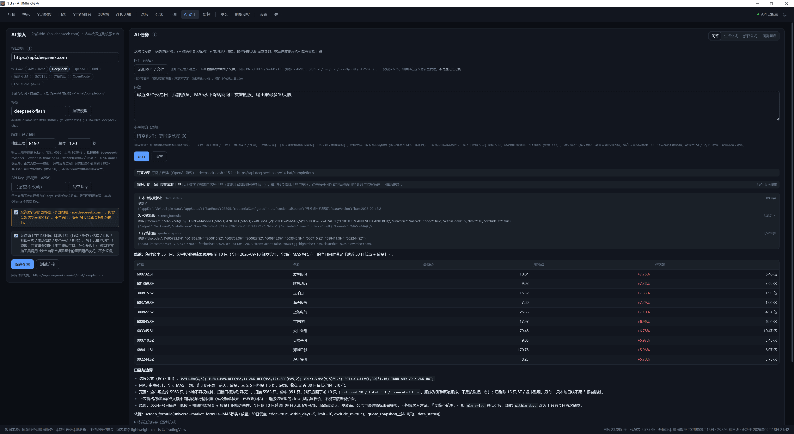

### 监控和消息推送（可选）

在监控页面创建规则，例如价格、涨跌幅或公式信号达到条件时提醒。可以选择收盘巡检或盘中巡检，并配置企业微信、企业微信机器人或飞书群机器人。

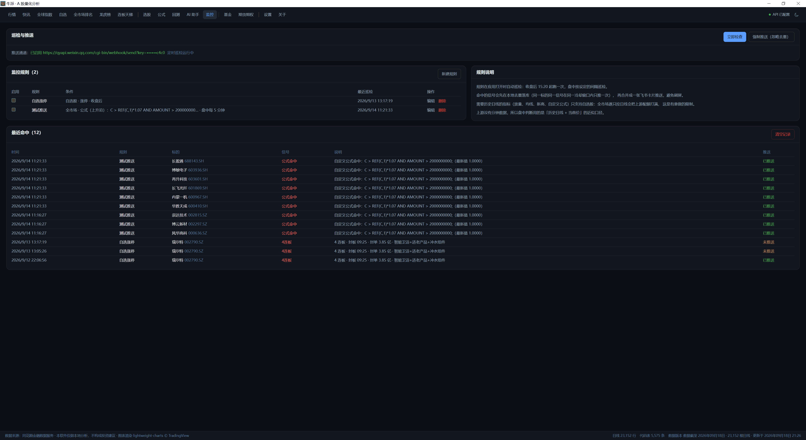

推送内容是本地规则计算出的摘要，不会把原始行情数据整包转发到群里。推送凭据同样只应保存在本机配置中。

### 基金、期货和期权

「基金」页面适合查看公募基金概况、业绩、持仓和资讯；「期货期权」页面可以查看品种目录、日线、主连基差、持仓和历史仓单等信息。

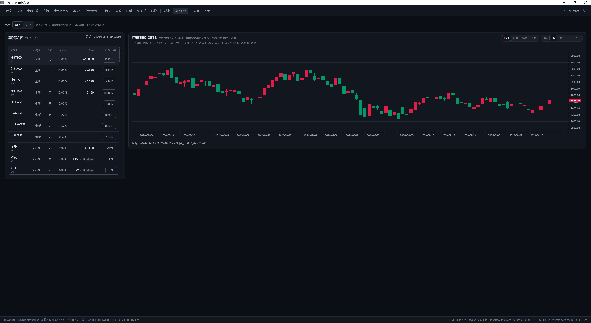

### 港美股（长桥，可选）

「港美股」页接入长桥 OpenAPI，用来看港股和美股的行情——**只读**：不接交易通道、不会下单，也不会把行情转发到别处。第一次使用：

1. 打开「港美股」页，点「用长桥账号登录」，在浏览器里授权一次即可（不用抄 App Key / Secret；要用 API Key 的话在同一张卡片的「高级」里填）；
2. 页面顶部会写明连接状态和**报价级别**：免费档常见口径是港股 BMP（没有实时推送、第 20 个之后延迟）+ 美股 LV1（含盘前盘后）。级别由长桥决定，买了行情卡才会变成实时。

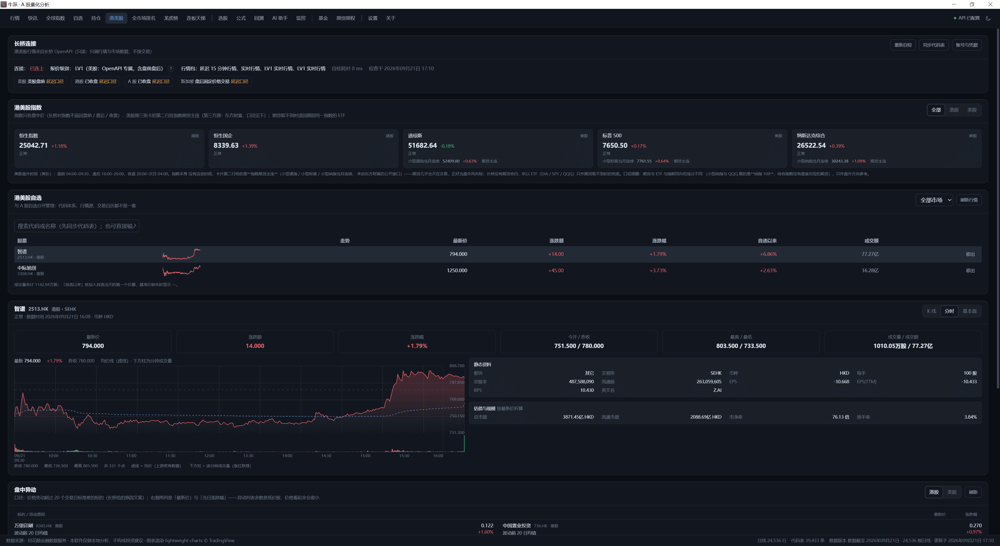

页面从上到下是：指数条 → 自选 → 个股详情 → 盘中异动。

- **指数条**：恒生指数 / 恒生国企 / 道琼斯 / 标普 500 / 纳斯达克综合。指数本身只有盘中价，所以每张卡第二行给的是对应的**指数期货主连**（小型道指 / 小型标普 / 小型纳指当月连续，来自第三方公开数据）——期货几乎全天都在交易，正好用来看盘前和夜盘；期货取不到时会退回跟踪同一指数的 ETF 的盘外成交。口径提醒：纳指综合没有自己的期货，那一行跟的是纳指 100 的期货与 ETF，只作方向参考（卡片脚注里也写明了）。
- **自选**：和 A 股自选分开存，可以搜索代码或名称加入，指数也能加（例如搜「道琼斯」）；列表带涨跌额、涨跌幅、自选以来涨跌幅和迷你走势。
- **个股**：K 线（日 / 周 / 月 / 季 / 年与 1–240 分钟）、分时、静态资料、估值与规模、基本面、盘中异动。分时在**美股**上还能切「盘前 / 盘中 / 盘后 / 夜盘 / 全天」，夜盘要求该标的在长桥的「夜盘可交易名单」里；港股只有常规时段和 16:00–16:10 收盘竞价。

## 四、推荐使用顺序

如果只是想快速开始，可以按下面的顺序操作：

1. 配置 API Key；
2. 同步全市场代码表；
3. 搜索一只股票，查看 K 线和基本资料；
4. 把常看的股票加入自选并分组；
5. 需要全市场扫描时，再导入全市场日线；
6. 用条件选股找到候选股票；
7. 用回测检查策略在历史上的表现；
8. 确认规则稳定后，再配置监控和消息推送。

想看港美股时，在「港美股」页点一次「用长桥账号登录」，然后在页面里的自选搜索代码或名称即可（它是独立的一块，不影响 A 股的 Key 与数据）。

## 五、数据和风险提示
 
- 牛派是研究和分析工具，不接入券商交易通道，也不会自动下单。
- 指标、选股和回测结果依赖本地数据和参数设置，不构成投资建议。
- API Key、推送凭据和模型 Key 不要放进截图、日志、Issue 或公开文档。
- 公开快讯和全球指数可能受网络或上游接口变化影响；重要判断请核对数据时间和来源。
- 港美股行情来自长桥（登录授权只保存在本机），指数卡片里的期货主连来自第三方公开数据：两者都会受网络、行情权限和上游变化影响，出现「取不到」或与手机 App 不一致时，先看报价级别与数据时间。

遇到问题时，请在仓库 Issues 中提供软件版本、操作步骤和脱敏后的报错截图，不要提交任何凭据。
